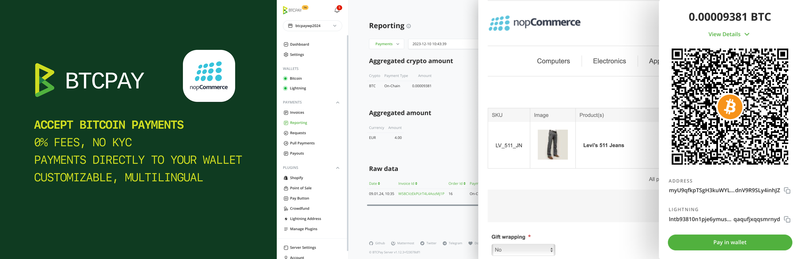

# BTCPay Server – Accept Bitcoin payments in nopCommerce

## Plugin Overview

This plugin allows you to easily start accepting Bitcoin payments in your nopCommerce e-commerce store using BTCPay Server — a free, self-hosted and open-source Bitcoin payment gateway. 

## Features

- 0% Fees: Enjoy a payment gateway with no fees. Yes, really!
- No complicated KYC needed, you're your own self-hosted payment gateway
- Automated invoice management and refunds
- Simple and customizable checkout UX, available in 30+ languages
- Direct payments to your wallet, no intermediary
- Reporting and accounting – CSV exports
- Real-time exchange price tracking for correct payment amounts
- Community-driven support
- Extensive documentation and video tutorials

## Getting Started 

### Download and installation

The plugins can be downloaded through [nopCommerce Marketplace](https://www.nopcommerce.com/marketplace/) or [GitHub](https://github.com/btcpayserver/nopcommerce) 

For installing the plugin through nopCommerce, upload the plugin directly from nopCommerce `Configuration > Local plugins > Upload plugin or a theme`. Ensure the plugin file is in ZIP for successful upload. After uploading, find the plugin in the list, click "Install" next to it, and enable it if needed​.

Alternatively you can manually add upload the plugin to the `/plugins` folder in your nopCommerce directory and restart the application.

Once the plugin is uploaded, make sure to click `Install` button and `Restart application` to apply the changes.

## Plugin configuration

You can configure the plugin either automatically or manually. Automatic setup is much faster and recommended. To begin configuring the plugin, click on the `Configure` button in the

### Automatic Configuration

1. Enter Url to your BTCPay Server into **BTCPay URL** field. (e.g. https://mainnet.demo.btcpayserver.org)
2. Click on the **Configure automatically** button to be redirected to the API authorization page of your BTCPay Server
3. On the authorization page: Select the store you want to connect to your nopCommerce (you might need to login first)
4. Click on "Authorize App" button and you will be redirected back to your nopCommerce
5. The "API Key", "BTCPay Store ID" and "Webhook Secret" fields will be automatically filled and a webhook created
6. Click **Save** button at bottom to persist the configuration. 
7. Click **Activate** to enable the plugin. Congrats, the configuration is now complete!

*Note: given the architecture of nopCommerce, it is possible that malfunctions in redirections may occur. Particularly if https is disabled or incorrectly configured. In this case, please opt for manual configuration.*

### Manual Configuration

Ensure that the following fields are filled out: 
- BTCPay Url
- BTCPay Store ID
- API Key
- WebHook Secret

#### BTCPay URL

In the BTCPay URL field of your nopCommerce, simply input the link to your self-hosted server or the one hosted by a [third-party provider](https://directory.btcpayserver.org/filter/hosts). For example; https://mainnet.demo.btcpayserver.org

#### BTCPay Store ID

BTCPay **Store ID** can be obtained from your BTCPay Server, in Store Settings > General > Store ID field. Copy it and paste it over in the `BTCPay Store ID` field.

#### Generating the API key

1. To create the **BTCPay API key**, click on the `Account` located at the bottom of the sidebar of youur BTCPay Server.
2. Click on the `Manage Account > API Key`.
3. Click on the `Generate API key` button
4. Click on the checkboxes and enable the following permissions:
  - View invoices
  - Create an invoice
  - Modify invoices
  - Modify selected stores' webhooks
  - View your stores 
  - Create non-approved pull payments in selected stores (optional)

*Note: To use the [refund feature](https://docs.btcpayserver.org/Refund/#refunds), you must also add the "Create non-approved pull payments" permission. After a refund, an order note is created where you can copy the pull payments link and send to your customer to claim it (this order note is also visible by the customer). The customer can request the refund on that page by filling out refund address.*

#### Generating the webhook

1. In your nopCommerce, copy the "Webhook Url" shown on the bottom of the BTCPay plugin configuration screen. 
2. Next, go to your BTCPay Server `Store Settings > Webhooks`
4. Click on the `Create Webhook` button
5. Paste the `Webhook Url` you copied from nopCommerce (step 1) into `Payload URL` field
6. Click on the "Eye" icon next to the `Secret` field to reveal the secret key and copy it.
7. Don't forget to click on the `Add webhook` to apply all the changes.
8. Go back nopCommerce and paste the Secret Key into the `WebHook Secret` field
9. Click save to apply all the changes
7. Click `Activate` to enable the plugin. Congrats, the configuration is now complete!

Now your BTCPay Server is connected to your nopCommerce sucessfully.

## Support

Feel free to join our support channel over at [Mattermost](https://chat.btcpayserver.org/) or [Telegram](https://t.me/btcpayserver) if you need help or have any further questions.

If experience a bug please [open a bug report](https://github.com/btcpayserver/btcpay-nopCommerce-plugin/issues)

## License

This plugin is released under the [MIT License](LICENSE).

The non-profit [BTCPay Server Foundation](https://btcpayserver.org) is committed to keeping this powerful payment plugin free forever. Our mission is to enable anyone to accept bitcoin regardless of financial, technical, social or political barriers.

---
